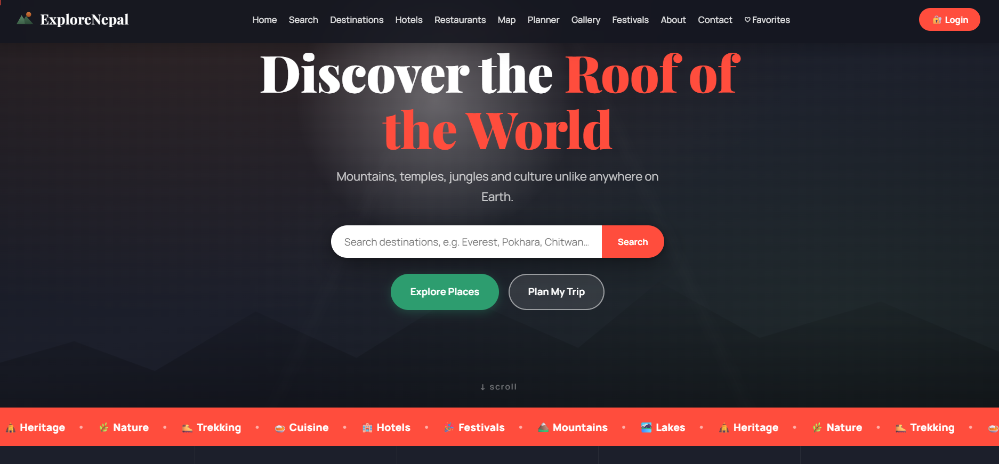

# 🏔️ ExploreNepal

A full-stack tourism web application showcasing Nepal's destinations, hotels, and restaurants — built with a custom-designed frontend and a Node.js/Express/MongoDB backend.

**🔗 Live Demo:** [explore-nepal12.netlify.app](https://explore-nepal12.netlify.app)
**⚙️ Backend API:** [explorenepal-backend.onrender.com](https://explorenepal-backend.onrender.com)

---

## 📸 Preview




## ✨ Features

### Core
- **30 destinations** across Nepal with detailed descriptions, best travel seasons, entry fees, and activities
- **10 hotels & 10 restaurants** with amenities, pricing, and contact info
- **Interactive map** (Leaflet/OpenStreetMap) with colour-coded destination markers
- **Smart search** across destinations by name, province, category, or activity
- **User reviews & star ratings** — submitted reviews stored via Firebase, visible to all visitors
- **User authentication** — sign up / log in system

### Trip Planning
- **Day-by-day Trip Planner** — build a personalised itinerary
- **PDF export** — download your itinerary as a styled PDF
- **QR code generator** — scan-to-view your itinerary on mobile
- **Favorites / Wishlist** — save destinations locally to build a shortlist
- **Compare Destinations** — side-by-side comparison of up to 3 places

### Content & Culture
- **Photo gallery** with category filters and lightbox viewer
- **Nepali Festival Calendar** — plan trips around Dashain, Tihar, Holi, and more
- **Social sharing** — share any destination via WhatsApp, Facebook, or copied link

### Design & Polish
- Custom premium UI — no template used, fully hand-built CSS
- Scroll-triggered reveal animations, animated stat counters, parallax hero
- Fully responsive — mobile, tablet, and desktop
- SEO meta tags & Open Graph preview cards for social sharing

---

## 🛠️ Tech Stack

**Frontend:** HTML5, CSS3 (custom, no framework), Vanilla JavaScript
**Backend:** Node.js, Express.js
**Database:** MongoDB Atlas
**Auth:** Firebase Authentication
**Libraries:** Leaflet.js (maps), jsPDF (PDF export)
**Hosting:** Netlify (frontend), Render (backend)

---

## 📁 Project Structure

```
explore_nepal/
├── index.html          # Main HTML structure
├── style.css           # All styling
├── script.js           # All frontend logic
├── data.js             # Local destination/hotel/restaurant data
└── backend/
    ├── server.js        # Express server entry point
    ├── seed.js          # Database seeding script
    ├── models/          # Mongoose schemas
    └── routes/          # API routes
```

---

## 🚀 Running Locally

**Frontend:**
Just open `index.html` in a browser, or serve it with a local server (e.g. VS Code Live Server).

**Backend:**
```bash
cd backend
npm install
node seed.js      # populate the database
npm run dev       # start the server
```

You'll need a `.env` file in `backend/` with:
```
MONGO_URI=your_mongodb_connection_string
PORT=5000
ADMIN_PASSWORD=your_admin_password
```

---

## 👤 Author

**Rijan Khatri**
BIT Student, Phoenix College of Management (Lincoln University College)
GitHub: [@logan2888](https://github.com/logan2888)

---

## 📝 License

This project was built as an academic final-year project and portfolio piece.
